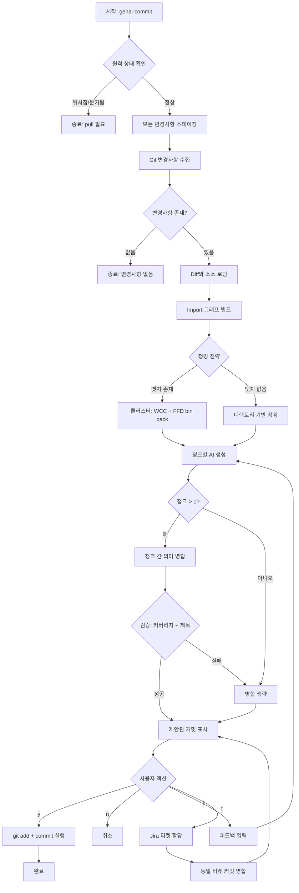

# genai-commit

Claude Code, Cursor CLI, Codex CLI를 활용한 AI 기반 커밋 메시지 생성 도구.

[](https://www.npmjs.com/package/genai-commit)
[](https://opensource.org/licenses/MIT)
[](https://github.com/Seungwoo321/genai-commit)

> 다른 언어로 보기: [English](./README.md)

## 주요 기능

- **AI 기반 커밋 메시지** - Claude Code, Cursor CLI, Codex CLI를 사용해 의미 있는 커밋 메시지 생성
- **Conventional Commits 준수** - Conventional Commits 명세를 자동으로 따름
- **다국어 지원** - 영어 또는 한국어로 제목과 본문 생성
- **Jira 연동** - 커밋에 Jira 티켓을 할당하고 동일 티켓의 변경사항을 자동 병합
- **인터랙티브 워크플로우** - 커밋 전에 검토, 피드백, 재생성 가능
- **스마트 파일 그룹화** - 변경사항을 논리적인 단위의 커밋으로 지능적으로 분리
- **클러스터 기반 청킹** - 대규모 변경에서는 import 그래프를 만들고 연관된 파일을 같은 청크로 묶어 각 AI 호출이 일관된 단위를 보도록 처리
- **청크 간 의미 병합** - 서로 다른 청크가 같은 논리적 변경을 표현한 경우, 검증 기반 롤백이 적용된 병합 패스가 이를 통합 (잘못된 병합보다 잘못된 분리를 우선)
- **자동 스테이징** - diff 분석 전에 추적되지 않은 파일, 이름 변경, 삭제된 파일을 포함한 모든 변경사항을 스테이징
- **빈 저장소 지원** - 커밋 이력이 없어도 커밋 생성 가능
- **원격 동기화 보호** - 브랜치가 원격보다 뒤처지거나 분기된 경우 조기 종료
- **Gitignore 인식** - `.gitignore`를 존중하며 하위 디렉토리에서도 정상 동작

## 지원하는 파일 변경 유형

| 변경 유형 | 지원 여부 |
|-----------|-----------|
| 추가된 파일 | 지원 |
| 수정된 파일 | 지원 |
| 삭제된 파일 | 지원 |
| 이름 변경된 파일 | 지원 |
| 추적되지 않은 파일 | 지원 (자동 스테이징) |
| 하위 디렉토리의 파일 | 지원 |
| 빈 저장소 (커밋 이력 없음) | 지원 |

## 동작 방식



### 아키텍처 원칙

**결정적인 로직은 코드로, 진정으로 비결정적인 부분만 LLM에 맡긴다.**

- **결정적 (프로그램 기반)**
  - 언어별 정규식 기반 import 그래프 추출 (ts/js/py/go/rust/java)
  - 연관 파일에 대한 Weakly-Connected-Components 클러스터링
  - 청크 크기 예산에 맞춘 First-Fit Decreasing bin packing
  - 커버리지 검증, 제목 길이 검사, 파일 경로 verbatim 강제
- **비결정적 (LLM 기반)**
  - 그룹화된 파일 집합으로부터 자연어 제목/본문 작성
  - 서로 다른 청크의 파일들이 같은 논리적 변경인지 판단
  - 병합 결과가 거부되면 청크별 결과로 롤백 — AI 비용을 두 배로 늘리는 재시도는 없음

## 사전 요구사항

다음 AI CLI 도구 중 최소 하나가 설치되어 있어야 합니다:

- [Claude Code CLI](https://docs.anthropic.com/en/docs/claude-code) - Anthropic 공식 CLI (명령어: `claude`)
- [Cursor Agent CLI](https://www.cursor.com/) - Cursor 에이전트 CLI (명령어: `agent`)
- [OpenAI Codex CLI](https://github.com/openai/codex) - OpenAI Codex CLI (명령어: `codex`)

## 프로바이더

각 프로바이더는 정식 이름 또는 단축 별칭으로 사용할 수 있습니다:

| 정식 이름 | 단축 별칭 | 실제 CLI |
|-----------|-----------|----------|
| `claude-code` | `claude` | `claude` |
| `cursor-cli` | `cursor` | `agent` |
| `codex-cli` | `codex` | `codex` |

## 설치

```bash
# 전역 설치
npm install -g genai-commit

# 또는 npx로 즉시 실행 (설치 불필요)
npx genai-commit claude
```

## 사용법

### 커밋 메시지 생성

```bash
# 정식 이름 사용
genai-commit claude-code
genai-commit cursor-cli
genai-commit codex-cli

# 단축 별칭 사용 (동일하게 동작)
genai-commit claude
genai-commit cursor
genai-commit codex

# 특정 모델 지정
genai-commit cursor --model claude-4.5-sonnet
genai-commit claude --model sonnet
genai-commit codex --model gpt-5.4

# 제목과 본문 언어를 동일하게 설정
genai-commit claude --lang ko

# 제목과 본문 언어를 분리하여 설정
genai-commit claude --title-lang en --message-lang ko
```

### 인증

```bash
# 로그인
genai-commit login cursor
genai-commit login claude
genai-commit login codex

# 상태 확인
genai-commit status claude
genai-commit status cursor
genai-commit status codex
```

### 지원 모델 목록 확인

```bash
genai-commit models cursor
genai-commit models claude
genai-commit models codex
```

### 인터랙티브 옵션

커밋 메시지 생성 후 다음과 같은 인터랙티브 메뉴가 표시됩니다:

| 옵션 | 설명 |
|------|------|
| `[y]` | 제안된 모든 커밋 실행 |
| `[n]` | 취소 |
| `[f]` | 피드백을 입력해 재생성 |
| `[t]` | Jira 티켓을 할당하고 커밋 재구성 |

## 옵션

| 옵션 | 설명 | 기본값 |
|------|------|--------|
| `--lang <lang>` | 제목과 본문 언어를 함께 설정 (en\|ko) | - |
| `--title-lang <lang>` | 커밋 제목 언어 | `en` |
| `--message-lang <lang>` | 커밋 본문 언어 | `ko` |
| `--model <model>` | 사용할 모델 | `haiku` (Claude) / `claude-4.5-sonnet` (Cursor) / `gpt-5.4` (Codex) |

## 사용 예시

### 기본 사용

```bash
# git 저장소로 이동
cd my-project

# 변경사항 작성
echo "console.log('hello');" >> src/index.js

# 커밋 생성
genai-commit claude
```

### Jira 연동 사용

1. `genai-commit claude` 실행
2. 제안된 커밋 검토
3. `t`를 눌러 Jira 티켓 할당
4. 각 커밋에 대한 Jira URL 입력
5. 동일한 Jira 티켓을 가진 커밋은 자동으로 병합됨
6. `y`를 눌러 커밋 실행

### 피드백 제공

1. `genai-commit cursor` 실행
2. 제안된 커밋 검토
3. `f`를 눌러 피드백 입력
4. 피드백 작성 (예: "인증 관련 변경사항을 별도 커밋으로 분리해줘")
5. AI가 피드백을 반영해 재생성
6. `y`를 눌러 커밋 실행

## 지원하는 커밋 타입

Conventional Commits 명세를 따릅니다:

| 타입 | 설명 |
|------|------|
| `feat` | 새 기능 |
| `fix` | 버그 수정 |
| `docs` | 문서 변경 |
| `style` | 포매팅 (코드 변경 없음) |
| `refactor` | 코드 리팩토링 |
| `test` | 테스트 추가 |
| `chore` | 유지보수 작업 |
| `perf` | 성능 개선 |
| `ci` | CI/CD 변경 |
| `build` | 빌드 시스템 변경 |

## 설정

기본값으로도 잘 동작하지만 다음 항목을 설정할 수 있습니다:

| 설정 | 기본값 | 설명 |
|------|--------|------|
| `maxInputSize` | 30000 | 청크 단위 입력 예산 (문자); 클러스터링과 bin-packing의 기준 |
| `maxDiffSize` | 15000 | 파일별 diff 최대 크기 (바이트, 초과분은 요약 처리) |
| `timeout` | 120000 | AI 요청 타임아웃 (ms) |
| `maxRetries` | 2 | 청크 단위 AI 재시도 횟수 |

## 요구사항

- Node.js >= 18.0.0
- Git 저장소
- Claude Code CLI, Cursor CLI, 또는 Codex CLI 설치 및 인증 완료

## 라이선스

MIT
