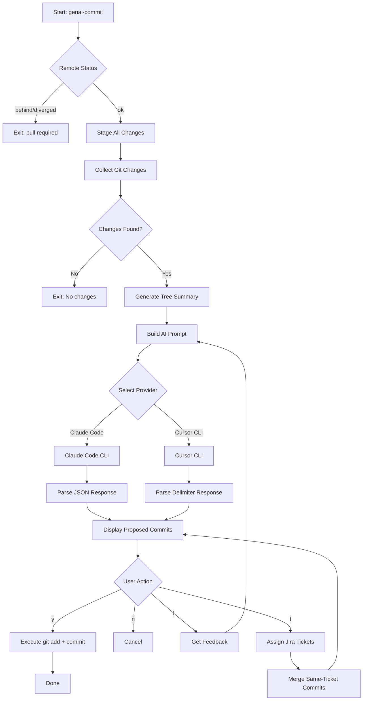

# genai-commit

AI-powered commit message generator using Claude Code, Cursor CLI, or Codex CLI.

[](https://www.npmjs.com/package/genai-commit)
[](https://opensource.org/licenses/MIT)
[](https://github.com/Seungwoo321/genai-commit)

## Features

- **AI-powered commit messages** - Generate meaningful commit messages using Claude Code, Cursor CLI, or Codex CLI
- **Conventional Commits** - Automatically follows the Conventional Commits specification
- **Multi-language support** - Generate titles and messages in English or Korean
- **Jira integration** - Assign Jira tickets to commits and auto-merge related changes
- **Interactive workflow** - Review, provide feedback, and refine before committing
- **Smart file grouping** - Intelligently splits changes into logical commits
- **Automatic staging** - Stages all changes (including untracked, renamed, and deleted files) before diff analysis
- **Works with empty repositories** - Generates commits even without prior commit history
- **Remote sync protection** - Aborts early if the branch is behind or diverged from remote
- **Gitignore-aware** - Respects `.gitignore` and works correctly from subdirectories

## Supported File Changes

| Change Type | Supported |
|-------------|-----------|
| Added files | Yes |
| Modified files | Yes |
| Deleted files | Yes |
| Renamed files | Yes |
| Untracked files | Yes (auto-staged) |
| Files in subdirectories | Yes |
| Empty repositories (no commits yet) | Yes |

## How It Works



## Prerequisites

You need at least one of these AI CLI tools installed:

- [Claude Code CLI](https://docs.anthropic.com/en/docs/claude-code) - Anthropic's official CLI (command: `claude`)
- [Cursor Agent CLI](https://www.cursor.com/) - Cursor's agent CLI (command: `agent`)
- [OpenAI Codex CLI](https://github.com/openai/codex) - OpenAI's Codex CLI (command: `codex`)

## Providers

Each provider can be referenced by its canonical name or short alias:

| Canonical | Short Alias | Underlying CLI |
|-----------|-------------|----------------|
| `claude-code` | `claude` | `claude` |
| `cursor-cli` | `cursor` | `agent` |
| `codex-cli` | `codex` | `codex` |

## Installation

```bash
# Global installation
npm install -g genai-commit

# Or use directly with npx (no installation required)
npx genai-commit claude
```

## Usage

### Generate Commit Messages

```bash
# Canonical names
genai-commit claude-code
genai-commit cursor-cli
genai-commit codex-cli

# Short aliases (equivalent)
genai-commit claude
genai-commit cursor
genai-commit codex

# With specific model
genai-commit cursor --model claude-4.5-sonnet
genai-commit claude --model sonnet
genai-commit codex --model gpt-5

# Set language for both title and message
genai-commit claude --lang ko

# Set languages separately
genai-commit claude --title-lang en --message-lang ko
```

### Authentication

```bash
# Login
genai-commit login cursor
genai-commit login claude
genai-commit login codex

# Check status
genai-commit status claude
genai-commit status cursor
genai-commit status codex
```

### List Supported Models

```bash
genai-commit models cursor
genai-commit models claude
genai-commit models codex
```

### Interactive Options

After generating commit messages, you'll see an interactive menu:

| Option | Description |
|--------|-------------|
| `[y]` | Commit all proposed commits |
| `[n]` | Cancel |
| `[f]` | Provide feedback to regenerate |
| `[t]` | Assign Jira tickets and regroup commits |

## Options

| Option | Description | Default |
|--------|-------------|---------|
| `--lang <lang>` | Set both title and message language (en\|ko) | - |
| `--title-lang <lang>` | Language for commit title | `en` |
| `--message-lang <lang>` | Language for commit message | `ko` |
| `--model <model>` | Model to use | `haiku` (Claude) / `claude-4.5-sonnet` (Cursor) / `gpt-5` (Codex) |

## Examples

### Basic Usage

```bash
# Navigate to your git repository
cd my-project

# Make some changes
echo "console.log('hello');" >> src/index.js

# Generate and create commits
genai-commit claude
```

### With Jira Integration

1. Run `genai-commit claude`
2. Review proposed commits
3. Press `t` to assign Jira tickets
4. Enter Jira URLs for each commit
5. Commits with the same Jira ticket are automatically merged
6. Press `y` to commit

### Providing Feedback

1. Run `genai-commit cursor`
2. Review proposed commits
3. Press `f` to provide feedback
4. Enter your feedback (e.g., "Split the auth changes into separate commits")
5. AI regenerates based on your feedback
6. Press `y` to commit

## Supported Commit Types

Following the Conventional Commits specification:

| Type | Description |
|------|-------------|
| `feat` | New feature |
| `fix` | Bug fix |
| `docs` | Documentation |
| `style` | Formatting (no code change) |
| `refactor` | Code restructuring |
| `test` | Adding tests |
| `chore` | Maintenance |
| `perf` | Performance improvement |
| `ci` | CI/CD changes |
| `build` | Build system changes |

## Configuration

The tool uses sensible defaults but can be configured:

| Setting | Default | Description |
|---------|---------|-------------|
| `maxInputSize` | 30000 | Maximum input size in bytes |
| `maxDiffSize` | 15000 | Maximum diff size in bytes |
| `timeout` | 120000 | AI request timeout in ms |
| `treeDepth` | 3 | Directory depth for tree compression |

## Requirements

- Node.js >= 18.0.0
- Git repository
- Claude Code CLI, Cursor CLI, or Codex CLI installed and authenticated

## License

MIT
